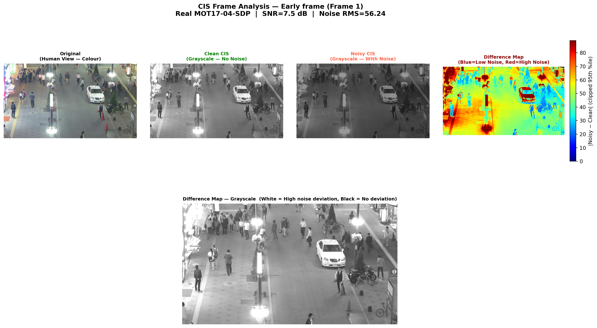
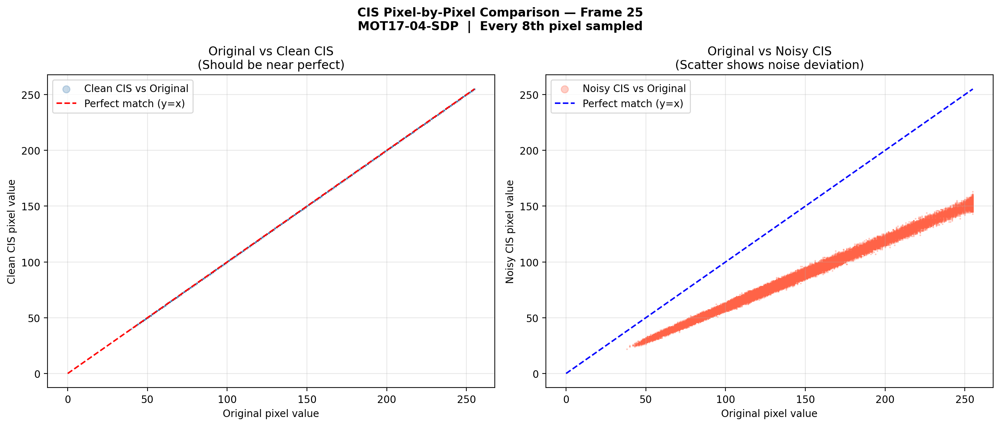
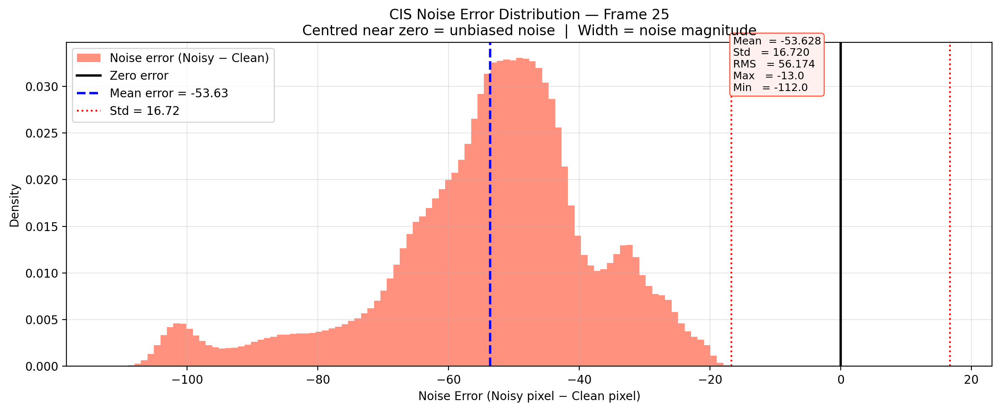
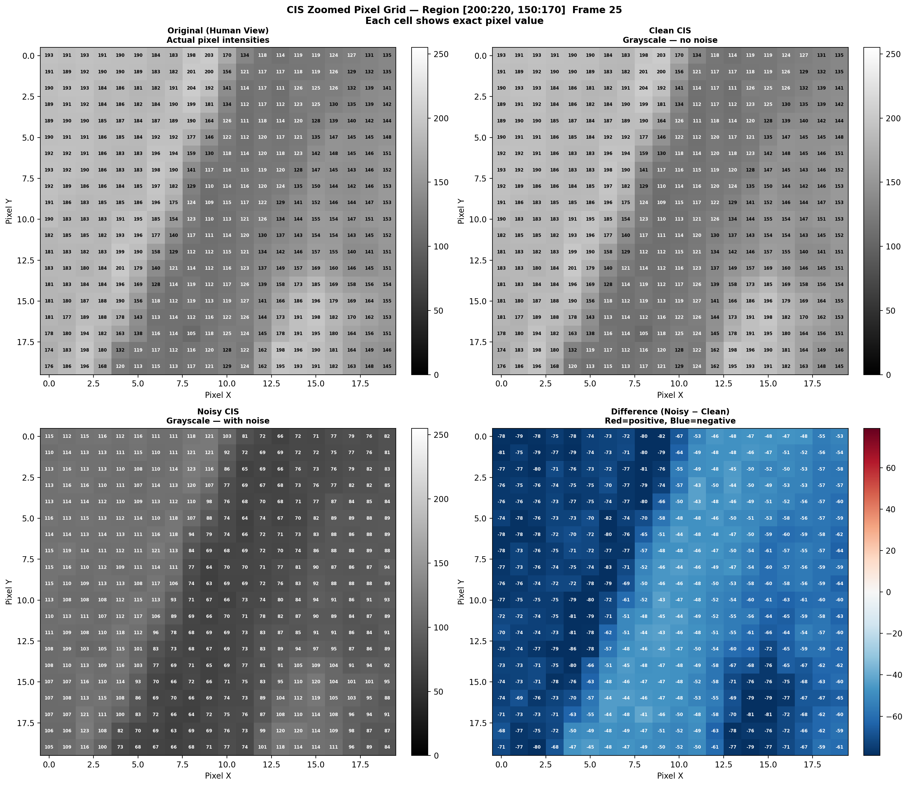
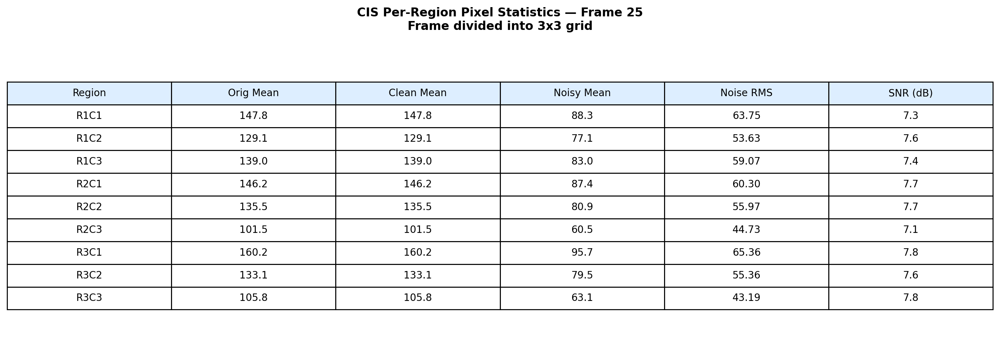
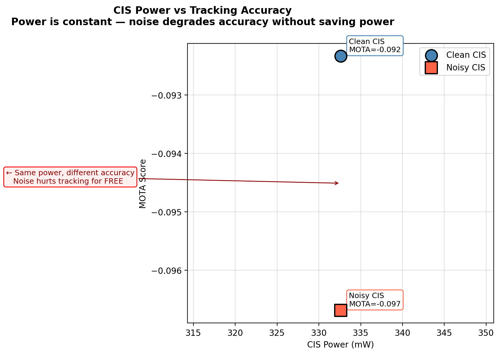
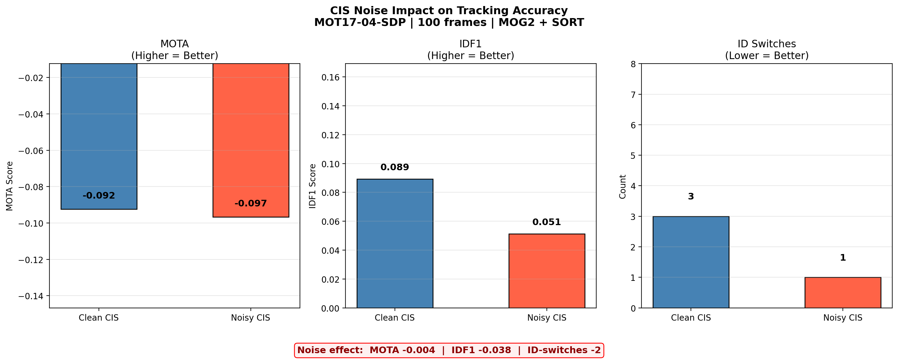
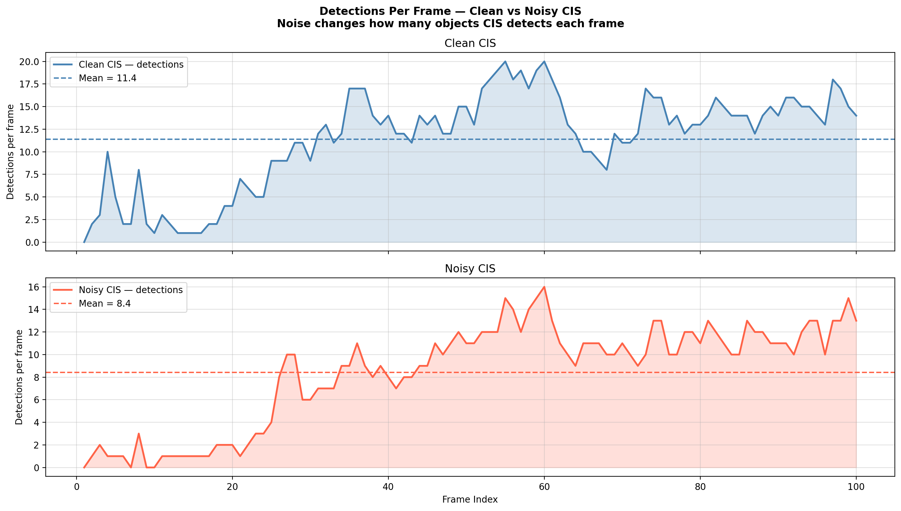
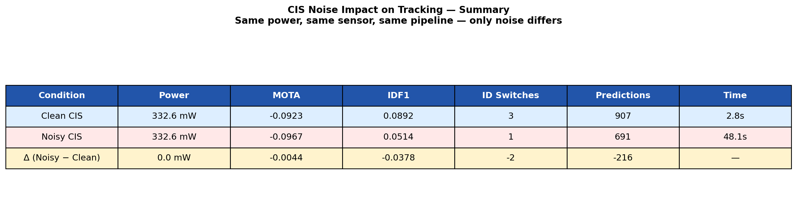

<div align="center">

# Harshitha's Work — CIS Modeling Component


**Contributor:** Harshitha Umesh &nbsp;|&nbsp; **Role:** CIS Modeling + Noise Validation + Tracking Benchmark

*EECE5698 Visual Sensing and Computing — Northeastern University*

</div>

---

## Key Results at a Glance

| Metric | Value | Note |
|--------|-------|------|
|  | Constant | Across ALL velocities and object sizes |
|  | Constant | 1 extra ADC bit for high texture only |
|  | Root cause | Of structurally constant power |
|  | Zero power saving | In return for quality loss |
|  | Predictable | Spatially fixed, calibration-correctable |

---

## Overview

This folder contains the **Conventional Image Sensor (CIS) modeling** component of the team's co-design framework. The work uses the course-provided **ModuCIS** simulator as the base and builds on top of it to:

1. **Characterize CIS power analytically** — sweeping velocities, object sizes, and backgrounds
2. **Validate noise behavior on real video** — MOT17-04-SDP pedestrian sequence
3. **Quantify tracking impact** — clean vs noisy CIS frames through MOG2 + SORT pipeline

> **Central finding:** CIS power is structurally constant — locked to worst-case scene requirements at design time and completely independent of actual scene activity at runtime.

---

## Folder Structure

```
Harshithas-work/
│
├── cis_model/                          ← MAIN RUNNABLE FOLDER
│   ├── [ModuCIS base files]            ← Course-provided simulator (professor's tool)
│   ├── final_cis_complete1.py          ← Synthetic sweep · main script
│   ├── cis_real_video.py               ← MOT17 noise characterization
│   ├── cis_noise_tracking.py           ← Clean vs noisy tracking benchmark
│   ├── cis_pixel_comparison.py         ← Pixel-level noise analysis
│   └── cis_detector.py                 ← Helper module (not run directly)
│
├── Harshithas_codes_and_results/       ← Explicit copy of contributed work
│   ├── codes/                          ← Copy of the 5 scripts above
│   └── results/
│       ├── analytical%20results/         ← Figures from synthetic sweep
│       ├── cis_real_video_results/     ← Figures from MOT17 noise analysis
│       ├── cis_noise_tracking_results/ ← Tracking performance figures
│       └── cis_pixel_results/          ← Pixel-level comparison figures
│
└── README.md
```

> **Note:** Run everything from `cis_model/`. The `Harshithas_codes_and_results/` folder is an explicit copy to make contributed scripts and outputs easy to find — not the folder to run from.

---

## What Was Done

<details>
<summary><b>Step 1 — Hardware Baseline Setup</b> &nbsp; </summary>

<br>

Configured the **ModuCIS** simulator with a 4T Active Pixel Sensor (APS) and SAR ADC at 640×480 VGA resolution using 65 nm process technology. ADC resolution derived per scene via a task-driven **SNR → ENOB → bits** pipeline — not fixed globally.

| Parameter | Value |
|-----------|-------|
| Analog supply voltage | 2.8 V |
| Digital supply voltage | 0.8 V |
| ADC type | SAR ADC |
| PLL output frequency | 44 MHz |
| Illumination | 5.0 W/m² (indoor) |
| Low-texture ADC | 8-bit (SNR = 36 dB) |
| High-texture ADC | 9-bit (SNR = 48 dB) |

</details>

---

<details>
<summary><b>Step 2 — Worst-Case FPS Locking</b></summary>

<br>

Derived the minimum frame rate to capture an object without missing it:

```
FPS_min   = (object_velocity / object_size) × safety_factor (10)
FPS_worst = (2000 / 25) × 10 = 800 fps
```

`CIS_Array` called **once per background** at 800 fps. Power held constant for all downstream analysis — every slower scene is permanently over-provisioned.

| Background | ADC bits | Power (mW) | Latency (ms) |
|------------|----------|------------|--------------|
| Low texture | 8 | **332.6** | 1.25 |
| High texture | 9 | **359.9** | 1.25 |

</details>

---

<details>
<summary><b>Step 3 — Synthetic Parametric Sweep</b> &nbsp; </summary>

<br>

Swept the full scene parameter space imported automatically from the shared team scene model:

- Velocities: **5–2000 px/s** (full sweep), {50, 500, 2000} px/s (animation scene)
- Object sizes: **{25, 50, 100, 125} px**
- Backgrounds: `low_texture` and `high_texture`
- Illumination: 5.0 W/m² indoor

**Results:**
- Power completely flat across all conditions — 40× range in event rate → **zero change** in CIS power
- Latency fixed at **1.25 ms** regardless of scene content
- SNR: low texture ≈ 20 dB, high texture ≈ 34 dB
- Dynamic range: 51.4 dB (low), 57.4 dB (high)
- Feasibility heatmap uniformly infeasible — reflects low object-background contrast, not a sensor deficiency

**Output figures:**

| CIS power vs event rate (animation) | CIS power vs velocity |
|---|---|
|  |  |

| SNR and dynamic range vs velocity | Latency vs velocity |
|---|---|
|  |  |

| Feasibility heatmap — low texture | Feasibility heatmap — high texture |
|---|---|
|  |  |

| Power heatmap — low texture | Power heatmap — high texture |
|---|---|
|  |  |

</details>

---

<details>
<summary><b>Step 4 — Real-World Noise Model</b> &nbsp; </summary>

<br>

Applied a 4-source physical noise model to **50 frames of MOT17-04-SDP** (night pedestrian street scene, 1920×1080). Sensor: QE = 0.60, full-well = 10,000 e⁻, ADC = 10-bit.

```
I_noisy = (I_signal × QE + n_shot + n_read + n_dark) × G_FPN
```

| Noise Source | Type | Value | Dominance |
|---|---|---|---|
| Shot noise | Poisson | ≈ 56 e⁻ RMS | Dominant stochastic |
| FPN | Gaussian gain | ≈ 33 e⁻ RMS | **Dominant overall** |
| Read noise | Gaussian | ≈ 3 e⁻ RMS | Negligible |
| Noisy CIS SNR | — | **7.5 dB** | Stable all 50 frames |

All sources flat across all 50 frames → CIS noise is **temporally stable and scene-activity independent**.

**Output figures:**

**Frame 1 — four-panel comparison (original / clean / noisy / difference heatmap)**


**Frame 26 — four-panel comparison**


**Frame 50 — four-panel comparison**


</details>

---

<details>
<summary><b>Step 5 — Pixel-Level Analysis</b> &nbsp; </summary>

<br>

Zoomed pixel grid on Frame 25 (1,228,800 pixels):
- Clean CIS values **identical** to original in every cell
- Noisy CIS values uniformly lower by **≈ 50–60 counts** regardless of brightness
- Per-region SNR (3×3 grid): consistently **7.1–7.8 dB** — spatially uniform FPN dominance
- Clean CIS clusters tightly along `y = x`; Noisy CIS shifts below as a parallel band — clear FPN signature

**Output figures:**

| Pixel scatter plot | Error histogram |
|---|---|
|  |  |

| Zoomed pixel grid | Stats table |
|---|---|
|  |  |

</details>

---

<details>
<summary><b>Step 6 — Tracking Impact Analysis</b> &nbsp; </summary>

<br>

MOG2 + SORT pipeline on **100 frames of MOT17-04-SDP**. Same hyperparameters throughout — only input frames differ (clean vs noisy).

| Metric | Clean | Noisy | Δ |
|--------|-------|-------|---|
| MOTA | −0.0923 | −0.0967 | −0.0044 |
| IDF1 | 0.0892 | 0.0514 | **−42%** |
| ID Switches | 3 | 1 | −2 |
| Total predictions | 907 | 691 | −24% |
| Mean det./frame | 11.4 | 8.4 | −3.0 |
| **Power (mW)** | **332.6** | **332.6** | **0.000** |

> **Critical finding:** CIS noise degrades tracking quality with **zero power saving**. In a DVS, raising the contrast threshold reduces both power and quality. In a CIS, no such trade-off exists.

**Output figures:**

| Power vs accuracy | Accuracy comparison |
|---|---|
|  |  |

| Detections over time | Summary table |
|---|---|
|  |  |

</details>

---

## How to Run

```bash
cd Harshithas-work/cis_model/

python final_cis_complete1.py      # synthetic parametric sweep
python cis_real_video.py           # MOT17 noise characterization
python cis_noise_tracking.py       # clean vs noisy tracking benchmark
python cis_pixel_comparison.py     # pixel-level noise figures
```

> `cis_detector.py` is a helper module — do not run directly.  
> `cis_real_video.py` and `cis_noise_tracking.py` require MOT17-04-SDP frames available locally.

---

## Key Takeaways

> **CIS power is structurally constant**  
> Locking to 800 fps worst-case yields 332.6 / 359.9 mW flat across all velocities (5–2000 px/s), object sizes (25–125 px), and event rates. No mechanism to reduce power at runtime — every slower scene permanently over-provisioned.

> **FPN dominates and is predictable**  
> Systematic −53.6 count darkening across all pixels. Temporally stable across 50 frames — fully calibration-correctable offline. Unlike DVS noise which varies dynamically with scene activity.

> **No power-accuracy trade-off in CIS**  
> Noise degrades tracking (−42% IDF1, −24% detections) at zero power saving. DVS can trade quality for power by adjusting contrast threshold. CIS cannot — this is the fundamental asymmetry between the two sensor modalities.

---

<div align="center">

*Part of Team 4 Final Project — EECE5698 Visual Sensing and Computing, Northeastern University*

</div>
