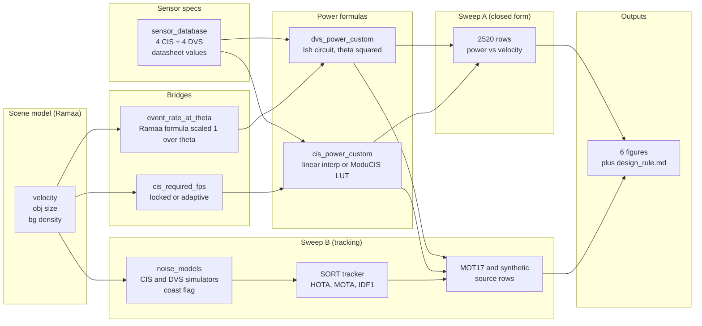

# F1 Pipeline Architecture

The unified CIS vs DVS pipeline. Ramaa's scene model feeds the scene
event rate and required FPS bridges, those plug into Harshitha's ModuCIS
and Ish's DVS circuit formula by way of the `sensor_database` datasheet
constants, and the two sweeps consume the resulting power functions.

The diagram renders in GitHub and VS Code preview. If you need a PNG,
open this file in VS Code and use the Markdown Preview Enhanced export
or paste the code block into `mermaid.live`.
